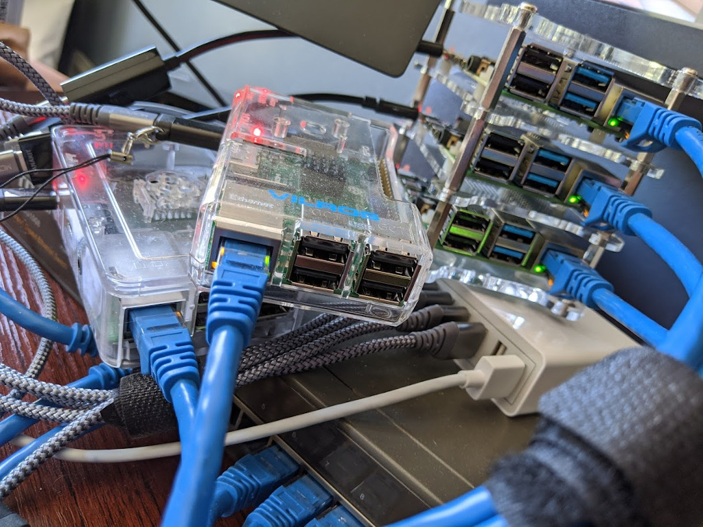

#This repository is archived and will no longer receive updates.

# Modifying a Disk Image for use with a Raspberry Pi or other single board computers

Building a homelab can be a fun way to both entertain yourself and to learn new concepts and technologies, and with the explosion in popularity of the Raspberry Pi and other single board computers (SBCs), it is easier than ever to build a multi-computer lab right from the comfort of your own home. Creating your own "Private Cloud at Home"-lab is a great way to get exposure to cloud-native technologies for considerably cheaper than trying to replicate the same setup with a major cloud provider.

In this article we will look at how to modify a disk image for the Raspberry Pi or other SBCs, to pre-configure the host for SSH and, in this case, disable the service that forces interaction for configuration on first boot. This is a great way to make your devices "boot and go", similar to cloud instances. More specialized, in-depth configuration can be done later by automated processes over an SSH connection.

Once you get started modifying disk images, as you add more Pis to your lab you can just write the image to an SD card, drop it into the Pi, and go!



## Decompressing and mounting the image

For this example, we will be modifying the [Fedora Server 31 ARM image](https://arm.fedoraproject.org/). Once the disk image is downloaded and its [checksum verified](https://arm.fedoraproject.org/verify.html), it needs to be decompressed and mounted to a location on a host computer's filesystem so it can be modified as needed.

We can use the `xz` program to decompress the Fedora-Server-armhfp-31-1.9-sda.raw.xz file we have downloaded. To decompress the file, use the `--decompress` argument.

```sh
xz --decompress Fedora-Server-armhfp-31-1.9-sda.raw.xz
```

Leaves us with Fedora-Server-armhfp-31-1.9-sda.raw decompressed disk image (and by default, replaces the `.xz` compressed file). This raw disk image is a just what it sounds like, a file containing all the data that would be on a formatted and installed disk. That includes partition information, the boot partition, root partition and any other partitions. We need to mount the partition we intend to work in, but to do that we need information about where that partition starts in the disk image and the size of the sectors on disk, so we can mount the file at the right sector.

Luckily, we can use `fdisk` on a disk image just as easily as a real disk, and use the `--list` or `-l` argument to view the list of partitions and their information:

<!-- markdownlint-disable MD014 -->
```sh
# Use fdisk to list the partitions in the raw image:
$ fdisk -l Fedora-Server-armhfp-31-1.9-sda.raw
Disk Fedora-Server-armhfp-31-1.9-sda.raw: 3.2 GiB, 3242196992 bytes, 6332416 sectors
Units: sectors of 1 * 512 = 512 bytes
Sector size (logical/physical): 512 bytes / 512 bytes
I/O size (minimum/optimal): 512 bytes / 512 bytes
Disklabel type: dos
Disk identifier: 0xdaad9f57

Device                               Boot   Start     End Sectors  Size Id Type
Fedora-Server-armhfp-31-1.9-sda.raw1         8192  163839  155648   76M  c W95 F
Fedora-Server-armhfp-31-1.9-sda.raw2 *     163840 1163263  999424  488M 83 Linux
Fedora-Server-armhfp-31-1.9-sda.raw3      1163264 6047743 4884480  2.3G 83 Linux
```
<!-- markdownlint-enable MD014 -->

We can see from this output all the information we need.  Line three tells us the sector size, logical and physical: (512 bytes / 512 bytes).

The list of devices shows us the partitions inside the raw disk image. The first one, `Fedora-Server-armhfp-31-1.9-sda.raw1` is no doubt the bootloader partition because it is first, small (only 76M), and is type W95 FAT32 (LBA) identified by the Id "c", a FAT32 partition for booting off the SD card.

The second partition is not very large either, just 488M. This partition is a Linux native type partition (Id 83), and it probably the Linux boot partition containing the kernel and initramfs.

Third partition is what we want probably: it is 2.3G in size, so it should have the majority of the distribution on it and is a Linux native partition type, which is expected. This should contain the partition and data we want to modify.

The third partition starts on sector 1163264 (as indicated by the "Start" column in the output of `fdisk`), so our mount offset is 595591168, or 512 * 1163264, calculated by multiplying the sector size (512) by the start sector (1163264).  This means we need to mount the file with an offset of 595591168 to put us in the right place at the mountpoint.

ARMed (see what I did there?) with this information, we can now mount the third partition to a directory in our homedir.

<!-- markdownlint-disable MD014 -->
```sh
$ mkdir ~/mnt
$ sudo mount -o loop,offset=595591168 Fedora-Server-armhfp-31-1.9-sda.raw ~/mnt
$ ls ~/mnt
```
<!-- markdownlint-enable MD014 -->

## Working within the disk image directly

Once the disk image has been decompressed and mounted to a spot on the host computer, it is time to start modifying the image to suit our needs. By far the easiest way to make changes to the image, at least in my opinion, is to use `chroot` to change the working root of our session to that of the mounted image. There's a tricky bit, though.

When we change root, our session will be using the binaries from the new root. Unless we are doing all of this from an ARM system, the architecture of the decompressed disk image will not be the same as the host system we are using. Even inside the chroot, the host system will not be able to make use of binaries with a different architecture. At least, not natively.

Luckily, there is a solution: qemu-user-static

From the [Debian Wiki](https://wiki.debian.org/RaspberryPi/qemu-user-static):

> "[qemu-user-static] provides the user mode emulation binaries, built statically. In this mode QEMU can launch Linux processes compiled for one CPU on another CPU... If binfmt-support package is installed, qemu-user-static package will register binary formats which the provided emulators can handle, so that it will be possible to run foreign binaries directly."

This is exactly what we need to be able to work in the non-native architecture inside of our chroot. If the host system is Fedora, install the `qemu-user-static` package with DNF, and restart `systemd-binfmt.service`.

```sh
# Enable non-native arch chroot with DNF, adding new binary format information
# Output suppressed for brevity
$ dnf install qemu-user-static
$ systemctl restart systemd-binfmt.service
```

With that, it should be possible to change root to the mounted disk image, and run the `uname` command to verify that everything is working.

```sh
sudo chroot ~/mnt/ /usr/bin/uname -a -r
Linux marvin 5.5.16-200.fc31.x86_64 #1 SMP Wed Apr 8 16:43:33 UTC 2020 armv7l armv7l armv7l GNU/Linux
```

From the output above, we can see that running `uname` from within the changed root shows `armv7l` in the output - the architecture of the raw disk image, and not the host machine. Everything is working as expected, and we can continue on to modify the image.

## Modifying the disk image

Now that it is possible to change directly into the ARM-based disk image and work in that environment, we can begin to make changes to the image itself. Our intentions are to set up the image to it can be booted and immediately accessed without having to do any additional setup directly on the Raspberry Pi. To do this, we need to install and enable sshd and add the authorized keys for ssh access.

And to make this behave more like a cloud environment and realize our dreams of a Private Cloud At Home, we will also add a local user, give that user `sudo` rights, and to be just like the cloud heavyweights, allow that user to use `sudo` without a password.

So, our TODO list is:

* install & enable sshd
* setup a local user
* allow the local user to use sudo (without a password, optional)
* add authorized keys
* allow root to ssh with the authorized keys (optional)

*Note: in the Fedora ARM image, sshd is already installed and enabled. It is included since this checklist is good for all distributions.*

I personally use the Github feature that allows you to upload your public SSH keys and have them available at `https://github.com/<your_github_username>.keys`. I find it a convenient way to distribute them, though I am paranoid enough that I always check that the downloaded keys match what I am expecting. You can copy your public keys into the chroot directly from your host computer if you do not wish to use that method, or you can host your keys on a webserver you control to use the same workflow.

To get started modifying the disk image, `chroot` into the mounted disk image again, this time starting a shell so multiple commands can be run.

```sh
# Output of these commands (if any) are omitted for brevity
$ sudo chroot ~/mnt /bin/bash

# Install openssh-server and enable it (already done on Fedora)
$ dnf install -y openssh-server
$ systemctl enable sshd.service

# Allow root to SSH with your authorized keys
$ mkdir /root/.ssh

# Download, or otherwise add to the authorized_keys file, your public keys
# Replace the URL with the path to your own public keys
$ curl https://github.com/clcollins.keys -o /root/.ssh/authorized_keys
$ chmod 700 /root/.ssh
$ chmod 600 /root/.ssh/authorized_keys

# Add a local user, and put them in the wheel group
# Change the group and user to whatever you desire
groupadd chris
useradd -g chris -G wheel -m -u 1000 chris

# Download or add your authorized keys
# Change the homedir and URL as you've done above
mkdir /home/chris/.ssh
curl https://github.com/clcollins.keys -o /home/chris/.ssh/authorized_keys
chmod 700 /home/chris/.ssh
chmod 600 /home/chris/.ssh/authorized_keys
chown -R chris.chris /home/chris/.ssh/

# Allow the wheel group (with your local user) to use suso without a password
echo "%wheel ALL=(ALL) NOPASSWD:ALL" >> /etc/sudoers.d/91-wheel-nopasswd
```

This is, in general, all that needs to be done to setup SSH to a Raspberry Pi or other single board computer on first boot. However, each distribution has their own quirks. For example, Rasbian already includes a local user, `pi` and does not use the `wheel` group, so for Raspbian at least, it may be desirable to use the existing user, or delete the `pi` user and replace it with another.

In the case of Fedora ARM, the image is setup to prompt to finish setup on first boot. This defeats the purpose of our changes above, especially since it blocks startup entirely until setup is complete. Our goal is to make our Raspberry Pi function like part of a private cloud infrastructure though, and that workflow includes setting up the host remotely via SSH when it starts up. So this initial setup has to be disabled. Luckily, this is controlled by the service `initial-setup.service`.

```sh
# Disable the initial-setup.service for both the multi-user and graphical targets
unlink /etc/systemd/system/multi-user.target.wants/initial-setup.service
unlink /etc/systemd/system/graphical.target.wants/initial-setup.service
```

While we are in the change root, we can many any other changes we might want for your systems, or just leave it at that and follow the cloud-native workflow of configuration over SSH after first boot.

## Recompress and install the modified image

With the changes to our system completed, all that is left is to recompress the disk image, and install it onto an SD card for use in our Raspberry Pi.

Make sure to exit the chroot, then unmount the disk image:

<!-- markdownlint-disable MD014 -->
```sh
$ sudo umount ~/mnt/
```
<!-- markdownlint-enable MD014 -->

Just as it was used to decompress the image initial, the `xz` command can be used to compress the image again. Using the `--keep` argument, `xz` will leave the raw image rather than cleaning it up.  While this uses more disk space, leaving the uncompressed image allows us to make incremental changes to the images we are working with without needing to wait for them to be decompressed each time.  This is great for saving time while testing images and tweaking them to our liking.

```sh
# Compress the raw disk image to a .xz file, but keep the raw disk image
xz --compress Fedora-Server-armhfp-31-1.9-sda.raw --keep
```

The compression takes a while, so take this time to stand up, stretch and get your blood flowing again.

Once the compression is done, the new, modified, disk image can be copied to an SD card to use with a Raspberry Pi! The standard `dd` method to copy the image to the SD card works fine. I like to use Fedora's `arm-image-installer` for some of the options it provides when working with unedited images, but it works great for our edited image as well and is a little more user-friendly than the `dd` command.

Make sure to check which disk the SD card is on, and use that for the `--media` argument.

```sh
# Use arm-image-installer to copy the modified disk image to the SD card
arm-image-installer --image=Fedora-Server-armhfp-31-1.9-sda.raw.xz --target=rpi3 --media=/dev/sdc --norootpass --resizefs -y
```

Now we are all set with a new, modified Fedora Server ARM image for Raspberry Pis or other single board computers, ready to boot and immediately SSH into with our modifications. This method can be used to make other changes as well, and do so with other distribution's raw disk images if you prefer them to Fedora. This is a good base from which to start to build a Private Cloud At Home homelab. Other articles will follow up on this start, and guide you through setting up a homelab using cloud technologies and automation.

## Further reading

A lot of research went into learning how to do the things in this article. Two of the most helpful sources for learning how to customize disk images and work with non-native architectures are included below, and were extremely helpful in rounding the corner from "I have no idea what I'm doing" to "Ok, I can do this!"

REF: [https://www.linux.com/news/how-modify-raw-disk-image-your-custom-linux-distro/](https://www.linux.com/news/how-modify-raw-disk-image-your-custom-linux-distro/)

REF: [https://wiki.mageia.org/en/Using_DNF#Setting_up_a_container_for_a_non-native_architecture](https://wiki.mageia.org/en/Using_DNF#Setting_up_a_container_for_a_non-native_architectur)
